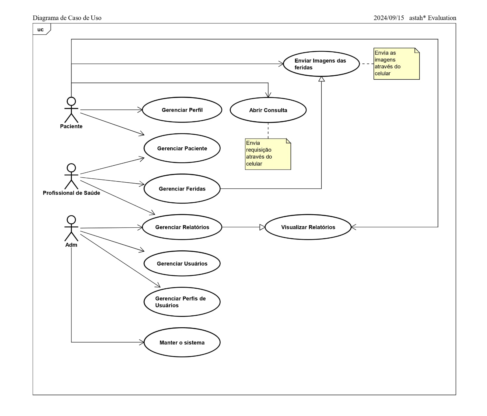
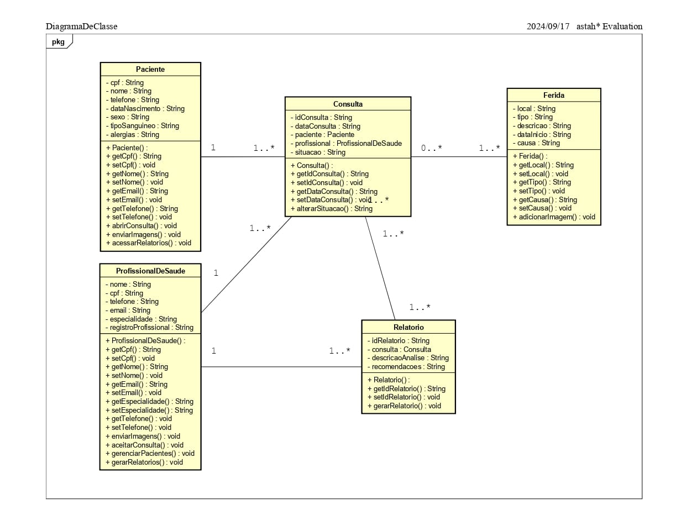

# 🩺 Heal - Gerenciamento de Feridas para Profissionais de Saúde

Este repositório contém o código-fonte e a documentação do **Heal**, um aplicativo desenvolvido como parte do Projeto Integrador da Fatec. O objetivo do Heal é auxiliar profissionais de saúde no **registro** e **gerenciamento** de feridas de pacientes, oferecendo funcionalidades essenciais para otimizar o acompanhamento de tratamentos.

## 🚀 Funcionalidades

- 🔐 **Cadastro e Login Seguro**: Pacientes e profissionais de saúde podem se registrar e acessar suas contas de forma protegida.
- 📋 **Gerenciamento de Pacientes**: Visualize, edite e acompanhe informações detalhadas sobre os pacientes.
- 📷 **Envio de Imagens**: Pacientes podem enviar fotos de suas feridas para análise, com orientações de como melhorar a qualidade das imagens.
- 📅 **Agendamento e Acompanhamento de Consultas**: Permite abrir e gerenciar consultas, facilitando a comunicação entre paciente e profissional.
- 📊 **Geração de Relatórios**: Criação de relatórios detalhados para acompanhamento e registro do histórico do paciente.

## 🛠️ Tecnologias Utilizadas

- **Linguagem**: Java ☕
- **IDE**: Android Studio 📱
- **Banco de Dados**: SQLite 🗄️
- **Versionamento**: Git e GitHub 🌐

```
Diagrama de Caso de uso:
```
<p align="center">
  
</p>

```
Diagrama de Classes:
```
<p align="center">
  
</p>


## 📦 Como Instalar e Executar

1. Clone este repositório:
   ```bash
   git clone https://github.com/seu-usuario/projeto-integrador-heal


## Acesse o Website do Heal

Para mais informações, acesse o [website do Heal](https://pedrotescaro.github.io/landing-page-heal).

## Repositório do Projeto

Você pode encontrar o código-fonte do projeto no [repositório do GitHub](https://github.com/pedrotescaro/landing-page-heal).

